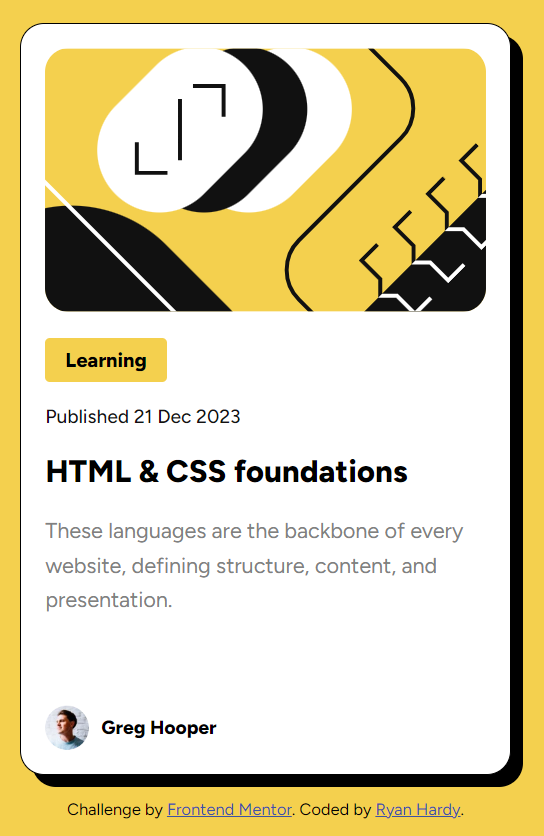
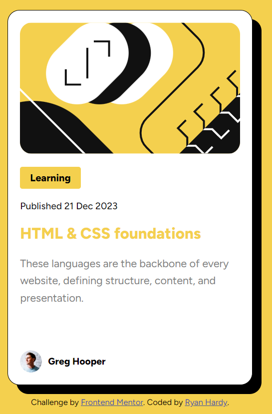

# Frontend Mentor - Blog preview card solution

This is a solution to the [Blog preview card challenge on Frontend Mentor](https://www.frontendmentor.io/challenges/blog-preview-card-ckPaj01IcS). Frontend Mentor challenges help you improve your coding skills by building realistic projects. 

## Table of contents

- [Frontend Mentor - Blog preview card solution](#frontend-mentor---blog-preview-card-solution)
    - [Table of contents](#table-of-contents)
    - [Overview](#overview)
        - [The challenge](#the-challenge)
        - [Screenshots](#screenshots)
        - [Links](#links)
    - [My process](#my-process)
        - [Built with](#built-with)
        - [What I learned](#what-i-learned)
        - [Continued development](#continued-development)

## Overview

### The challenge

Users should be able to:

- See hover and focus states for all interactive elements on the page

### Screenshots




### Links

- Solution URL: [https://github.com/ryyHardy/frontend-mentor-blog-preview-card/](https://github.com/ryyHardy/frontend-mentor-blog-preview-card/)
- Live Site URL: [https://ryyhardy.github.io/frontend-mentor-blog-preview-card/](https://ryyhardy.github.io/frontend-mentor-blog-preview-card/)

## My process

### Built with

- Semantic HTML5
- CSS
- Flexbox (a little bit)

### What I learned

I learned how to use the cascade of CSS to my advantage. When I was going through this challenge,
I wasn't happy with how the text elements were organized. Using what I knew about specificity
helped me clean up the CSS a bit and move on to other parts of the challenge.

For example, I used the "p" selector as a default for the paragraphs, and I used classes to overwrite
it when needed.

```css
.blog-card p {
  font-size: 0.9rem;
  line-height: 1.6em;
  color: var(--gray);
}

.blog-card .date {
  color: var(--black);
  font-weight: 500;
  font-size: 0.8rem;
  padding-bottom: 1em;
}

```

### Continued development

I want to take advantage of the way CSS works rather than working against it. The cleanest CSS
I've seen follows those principles, and I would like to learn more about how to do that. Also,
I'm not super happy with the CSS handling the active states or the weird unit values I used to
match the design. My eternal struggle with CSS units continues!
